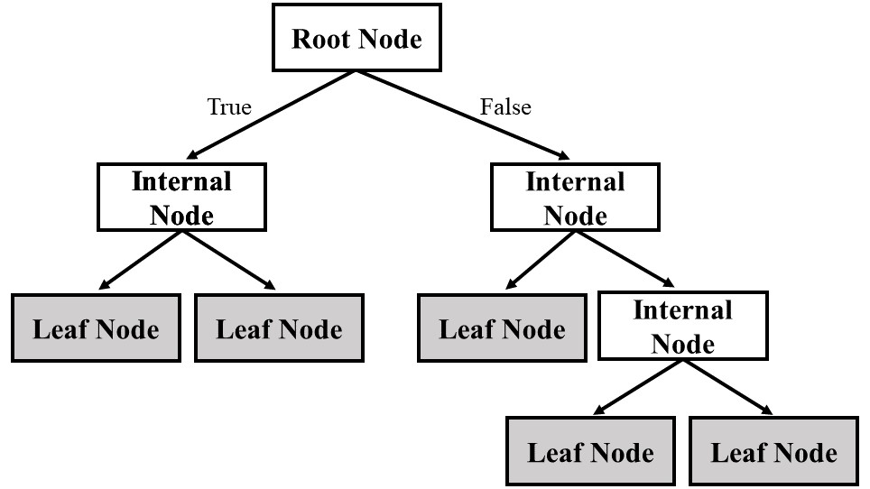
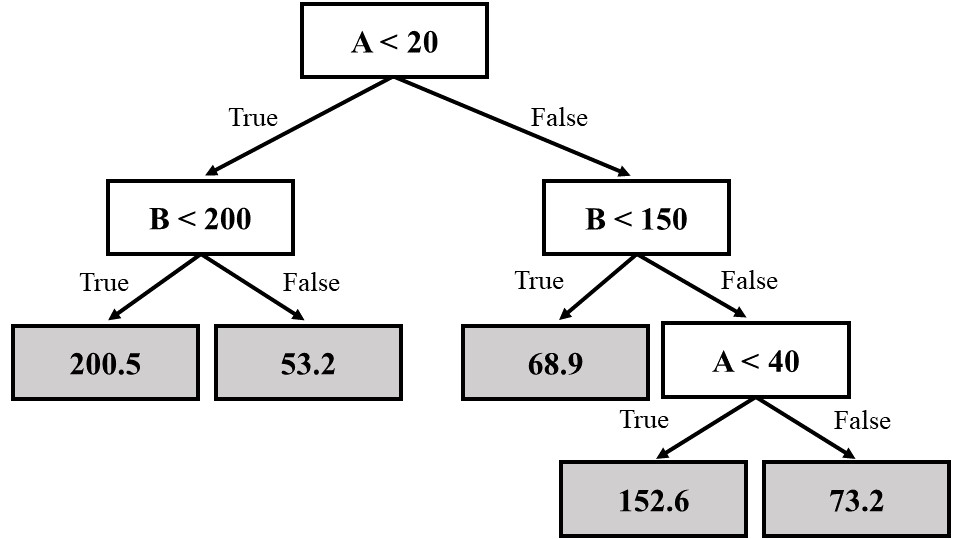

# Demystifying Decision Trees: Understanding Regression and Classification
 

Powerful Machine Learning Methods called Decision Trees can be applied to both classification and regression problems. The way they are organized resembles a tree, with each internal node standing in for a characteristic (or attribute), each branch for a decision rule, and each leaf node for a result. We shall examine the main distinctions between decision tree regression and classification in this essay.

----

### Table Of Contents:
- [The-Basics](#The-Basics) 
- [Decision-Tree-Regression](#Decision-Tree-Regression) 
- [Decision-Tree-Classification](#Decision-Tree-Classification) 
- [Key-Differences](#Key-Differences) 
- [Conclusion](#Conclusion) 

----

## The-Basics
Decision Trees are versatile and widely used in machine learning due to their interpretability and ease of use. Let's briefly go over the essential components of a decision tree before getting into the distinctions between regression and classification.

A decision tree is composed of:

1. Root Node: This is the topmost node that represents the entire dataset. It's the starting point for the decision-making process.
2. Internal Nodes: These nodes represent features or attributes from the dataset and are used for decision-making.
3. Leaf Nodes: These nodes represent the final outcome or prediction. In classification, each leaf node corresponds to a class label, while in regression, it represents a numerical value.

Now, let's explore Decision Tree Regression and Decision Tree Classification.

## Decision-Tree-Regression
Decision Tree Regression is used when the target variable is continuous, which involves predicting a numeric or constant output. It recursively splits the dataset into subsets based on feature values to minimize the variance within each subgroup.

Key points about Decision Tree Regression:
  - The leaf nodes in a Decision Tree Regression model contain continuous values.
  - Split decisions occur to reduce the volatility or standard deviation of the target variable.
  - A Decision Tree Regression output is a numeric value that represents a prediction.

## Decision-Tree-Classification
On the other hand, categorical target variables or class labels serve with decision tree classification. Each instance is given a class label depending on its characteristics and the dominant class in the leaf node.

Key points about Decision Tree Classification:
  - The leaf nodes in a Decision Tree Classification model contain class labels.
  - The split decisions occur to maximize the homogeneity or purity of the classes within each subset.
  - A Decision Tree Classification output is a class label representing the predicted category.

## Key-Differences
- Output: The most fundamental difference is the output. Decision Tree Regression predicts continuous values, while Decision Tree Classification predicts categorical class labels.
- Objective: In Decision Tree Regression, the aim is to minimize variance or standard deviation, whereas in Decision Tree Classification, the goal is to maximize homogeneity or purity within classes.
- Leaf Node Content: The content of leaf nodes varies; in regression, it's numeric, and in classification, it's categorical.

## Conclusion
In conclusion, Decision Tree Regression and Decision Tree Classification serve different purposes based on the nature of the target variable. Understanding these differences is essential when choosing the algorithm for your machine-learning task. Decision Trees remain a fundamental tool in machine learning, valued for their simplicity and interpretability.
